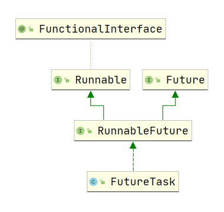
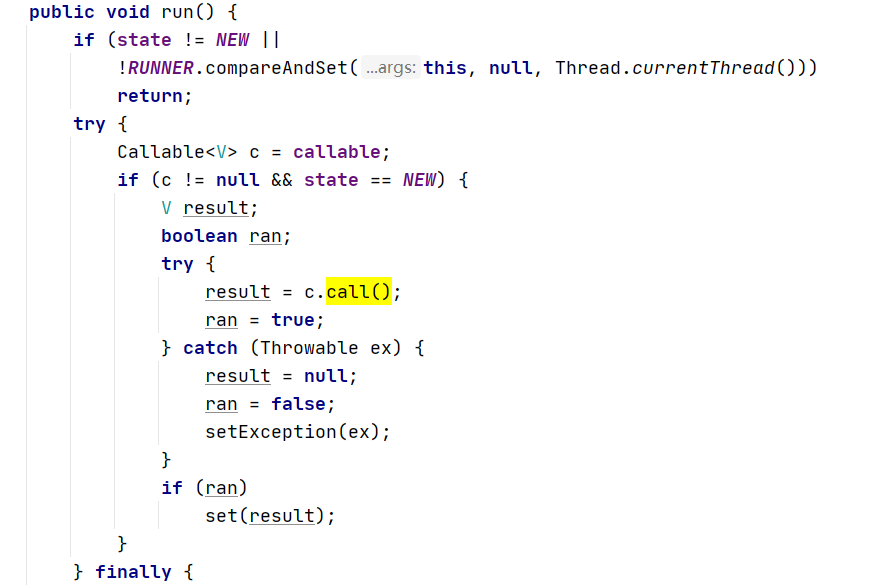

## 并发编程

### 1. 线程池相关问题

#### 1.1 线程池概念

线程池（Thread Pool）是一种基于池化思想管理线程的工具，经常出现在多线程服务器中，如MySQL。

线程过多会带来额外的开销，其中包括创建销毁线程的开销、调度线程的开销等等，同时也降低了计算机的整体性能。线程池维护多个线程，等待监督管理者分配可并发执行的任务。这种做法，一方面避免了处理任务时创建销毁线程开销的代价，另一方面避免了线程数量膨胀导致的过分调度问题，保证了对内核的充分利用。

而本文描述线程池是JDK中提供的ThreadPoolExecutor类。

当然，使用线程池可以带来一系列好处：

- **降低资源消耗**：通过池化技术重复利用已创建的线程，降低线程创建和销毁造成的损耗。
- **提高响应速度**：任务到达时，无需等待线程创建即可立即执行。
- **提高线程的可管理性**：线程是稀缺资源，如果无限制创建，不仅会消耗系统资源，还会因为线程的不合理分布导致资源调度失衡，降低系统的稳定性。使用线程池可以进行统一的分配、调优和监控。
- **提供更多更强大的功能**：线程池具备可拓展性，允许开发人员向其中增加更多的功能。比如延时定时线程池ScheduledThreadPoolExecutor，就允许任务延期执行或定期执行。

#### 1.2 线程池核心设计与实现

- 线程池解决了两个不同的问题：它们通常在执行大量异步任务时提供改进的性能，这是由于减少了每个任务的调用开销。此外它们提供了一种绑定和管理资源的方法，包括执行集合时所消耗的线程、任务。  每个`ThreadPoolExecutor`还维护一些基本统计信息，例如已完成任务的数量。 

##### 1.2.1 线程池的核心设计


线程池运行的状态，**并不是用户显式设置的**，而是伴随着线程池的运行，由内部来维护。线程池内部使用一个变量维护两个值：**运行状态(runState)和线程数量 (workerCount)**。在具体实现中，线程池将运行状态(runState)、线程数量 (workerCount)两个关键参数的维护放在了一起。

```java
private final AtomicInteger ctl = new AtomicInteger(ctlOf(RUNNING, 0));
```

在源码中，可以看到`ctl`这个AtomicInteger类型的变量，是对线程池的运行状态和线程池中有效线程的数量进行控制的一个字段， 它同时包含两部分的信息：线程池的运行状态 (runState) 和线程池内有效线程的数量 (workerCount)，高3位保存runState，低29位保存workerCount，两个变量之间互不干扰。==用一个变量去存储两个值，可避免在做相关决策时，出现不一致的情况，不必为了维护两者的一致，而占用锁资源。==通过阅读线程池源代码也可以发现，经常出现要同时判断线程池运行状态和线程数量的情况。线程池也提供了若干方法去供用户获得线程池当前的运行状态、线程个数。==这里都使用的是位运算的方式，相比于基本运算，速度也会快很多。==

##### 1.2.2 线程池的生命周期

线程池的生命周期图如图所示：


其各自对应状态的解释为：


##### 1.2.3 线程池的任务调度

任务调度是线程池的主要入口，当用户提交了一个任务，接下来这个任务将如何执行都是由这个阶段决定的。了解这部分就相当于了解了线程池的核心运行机制。

1. 调用线程池时，首先检测线程池运行状态，如果不是RUNNING，则直接拒绝，线程池要保证在RUNNING的状态下执行任务。
2. 如果workerCount < corePoolSize，则创建并启动一个线程来执行新提交的任务。
3. 如果workerCount >= corePoolSize，且线程池内的阻塞队列未满，则将任务添加到该阻塞队列中。
4. 如果workerCount >= corePoolSize && workerCount < maximumPoolSize，且线程池内的阻塞队列已满，则创建并启动一个线程来执行新提交的任务。
5. 如果workerCount >= maximumPoolSize，并且线程池内的阻塞队列已满, 则根据拒绝策略来处理该任务, 默认的处理方式是直接抛异常。


#### 1.3 什么是阻塞队列？阻塞队列的实现原理是什么？如何使用阻塞队列来实现生产者-消费者模型？

阻塞队列（BlockingQueue）是一个支持两个附加操作的队列。

这两个附加的操作是：在队列为空时，获取元素的线程会等待队列变为非空。当队列满时，存储元素的线程会等待队列可用。**阻塞队列常用于生产者和消费者的场景**，生产者是往队列里添加元素的线程，消费者是从队列里拿元素的线程。阻塞队列就是生产者存放元素的容器，而消费者也只从容器里拿元素。

从原理上看，我们可以发现阻塞队列的使用，就像是一个拥有加锁功能的队列，它对队列为空和队列满时的两种情况，提供了对应的锁，从而方便于生产者消费者的使用场景。

JDK7提供了7个阻塞队列。分别是： 

ArrayBlockingQueue ：一个由数组结构组成的有界阻塞队列。 

LinkedBlockingQueue ：一个由链表结构组成的有界阻塞队列。 

PriorityBlockingQueue ：一个支持优先级排序的无界阻塞队列。 

DelayQueue：一个使用优先级队列实现的无界阻塞队列。 

SynchronousQueue：一个不存储元素的阻塞队列。 

LinkedTransferQueue：一个由链表结构组成的无界阻塞队列。 

LinkedBlockingDeque：一个由链表结构组成的双向阻塞队列。

从原理上来看这几个阻塞队列，它们的差别主要在于实现的数据结构、是否有界、是否有额外功能。

观察实现的数据结构，分别有数组、单向队列、双向队列实现的。因此该类型的队列，其优劣和数组、单项队列、双向队列的优劣有直接关联，各自的增删改查速度、内存占用大小各有区别。

是否有界条件，表现的是队列是否有一个固定的容器大小上限，无界的队列可以支持扩容操作。

额外功能主要体现在是否支持优先级排序。

比较特别的是SynchronousQueue，这个队列不存储元素，且只支持直接take，而没有对应查看的peek函数可以查看元素，所以它的设计可能偏向于一些特别传递性的任务。

#### 1.4 线程池类型

常见的是四个线程池类型，但不推荐直接使用这四个线程池，因为它们默认线程池容量上限是Integer.MAX_VALUE，这容易导致线程开辟过多影响性能（而且比较难查出bug）。在阿里巴巴的java开发手册里，也明确了这一点。

1. newSingleThreadExecutor

- 这个线程池只有一个线程在工作，也就是相当于单线程串行执行所有任务。
  - 保证所有任务按照指定顺序(FIFO, LIFO, 优先级)执行。
  - 应用场景：**GUI单线程队列**

2.newFixedThreadPool

- 线程数少于核心线程数，也就是设置的线程数时，新建线程执行任务 

- 线程数等于核心线程数后，**将任务加入阻塞队列**，由于默认队列容量非常大，可以一直加加加 

- **执行完任务的线程反复去队列中取任务执行**

- 如果阻塞队列有设置大小，且当前阻塞队列的大小达到了该数值，后续的线程将被执行拒绝服务策略。

3. newCachedThreadPool

- 没有核心线程，直接向 SynchronousQueue 中提交任务 
- 如果有空闲线程，就去取出任务执行；如果没有空闲线程，就新建一个 
- **执行完任务的线程有 60 秒生存时间**，如果在这个时间内可以接到新任务，就可以继续活下去，否则会被销毁

4.newScheduledThreadPool

- 创建一个定长线程池，支持定时和周期性任务执行。

#### 1.5 线程池核心类-ThreadPoolExecutor

参数说明：ThreadPoolExecutor一共有七个参数，这七个参数配合起来，构成了线程池强大的功能。上面说的四个线程池，本质上就是对这个类的继承实现。

- corePoolSize：核心线程数量

- maximumPoolSize：线程最大线程数

- workQueue：阻塞队列，存储等待执行的任务，很重要，会对线程池运行过程产生重大影响

- keepAliveTime：线程没有任务执行时最多保持多久时间终止（当线程中的线程数量大于corePoolSize的时候，如果这时没有新的任务提交核心线程外的线程不会立即销毁，而是等待，直到超过keepAliveTime）
- unit：keepAliveTime的时间单位
- threadFactory：线程工厂，用来创建线程，有一个默认的工场来创建线程，这样新创建出来的线程有相同的优先级，是非守护线程、设置好了名称）
- rejectHandler：当拒绝处理任务时(阻塞队列满)的策略（AbortPolicy默认策略直接抛出异常、CallerRunsPolicy用调用者所在的线程执行任务、DiscardOldestPolicy丢弃队列中最靠前的任务并执行当前任务、DiscardPolicy直接丢弃当前任务）

---


### 2. 线程相关

#### 2.1. Java线程状态

java线程的状态，与一般的进程状态相比，java线程多了等待态和超时等待态，且它的运行态和阻塞态与进程状态稍有差别。

- 初始态（NEW）
  - 创建一个Thread对象，但还未调用start()启动线程时，线程处于初始态。

- 运行态（RUNNABLE）

  - 在Java中，运行态包括就绪态和运行态。

  - 就绪态
    - 该状态下的线程已经获得执行所需的所有资源，只要CPU分配执行权就能运行。所有就绪态的线程存放在就绪队列中。

  - 运行态
    - 获得CPU执行权，正在执行的线程。由于一个CPU同一时刻只能执行一条线程，因此每个CPU每个时刻只有一条运行态的线程。

- 阻塞态（BLOCKED）
  - 当一条正在执行的线程请求某一资源失败时，就会进入阻塞态。
  - **在Java中，阻塞态专指请求锁失败时进入的状态**。
  - 由一个阻塞队列存放所有阻塞态的线程。
  - 处于阻塞态的线程会不断请求资源，一旦请求成功，就会进入就绪队列，等待执行。

- 等待态（WAITING）
  - 可运行状态争抢锁成功，但是资源不满足，主动放弃锁（调用wait()方法）。条件满足后再恢复可运行状态（调用notiy()方法）。
  - 进入等待态的线程会释放CPU执行权，并释放资源（如：锁）
- 有时限等待（TIMED_WAITING）
  - 类似于等待，不过区别在于有一个等待的时间，到达等待时间后或者调用notiy()，都能恢复为可运行状态。
  - 有两种方式可以进入有时限等待：wait(Long)和sleep(Long)
- 终止态（TERMINATED）
  - 线程执行结束后的状态。


#### 2.2 线程上下文切换

引起线程上下文切换的原因

- 当前正在执行的任务完成，系统的cpu正常调度下一个任务

- 当前正在执行的任务遇到i/o等阻塞操作，调度器挂起此任务，继续调度下一个任务。

- 多个任务并发抢占资源，当前任务没有抢到锁资源，被调度器挂起，继续调度下一个任务，

- 用户的代码挂起当前任务，比如线程执行sleep方法，让出CPU。

- 硬件中断。

#### 2.3 线程创建方式

1. 继承Thread类

**注意，该方法本质上是唯一的创建线程方法，后面的方法，本质上是该方法不同化用而已。**

通过继承 Thread 类来创建线程的一般步骤如下：

1. 定义一个 Thread 类的子类，重写 run() 方法，将相关逻辑实现，run() 方法就是线程要执行的业务逻辑方法；
2. 创建自定义的线程子类对象；
3. 调用子类实例的 start() 方法来启动线程。

```javascript
public class MyThread extends Thread{ @Override public void run() { System.out.println(Thread.currentThread().getName()); }
}
public class MyThreadTest { public static void main(String[] args) { // 创建线程 MyThread thread = new MyThread(); // 启动线程 thread.start(); }
}
```

调用Thread的start方法，有native关键字，这表明该方法是调用底层os的方法，故而可以实现多线程的使用。

2. 实现 Runnable 接口

通过实现 Runnable 接口创建线程一般步骤如下：

1. 定义 Runnable 接口实现类 MyRunnable，并重写 run() 方法；
2. 创建 MyRunnable 实例 runnable，以 runnable 作为 target 创建 Thead 对象，该 Thread 对象才是真正的线程对象；
3. 调用线程对象的 start() 方法。

```java
public class MyRunnable implements Runnable{ @Override public void run() {             System.out.println(Thread.currentThread().getName()); }
}
public class MyRunnableTest { public static void main(String[] args) {
    MyRunnable myRunnable = new MyRunnable(); // 创建线程 Thread thread = new 		     Thread(myRunnable); // 启动线程 thread.start(); }
}
```

3. **使用 Callable 和 FutureTask 创建线程**

与 Runnable 接口不一样，Callable 接口提供了一个 call() 方法作为线程执行体，call() 方法比 run() 方法功能要强大，比如：call() 方法可以有返回值、call() 方法可以声明抛出异常。

Java5 提供了 Future 接口来代表 Callable 接口里 call() 方法的返回值，并且为 Future 接口提供了一个实现类 FutureTask，这个实现类既实现了 Future 接口，还实现了 Runnable 接口，因此可以作为 Thread 类的 target。在 Future 接口里定义了几个公共方法来控制它关联的 Callable 任务。

**为什么使用Callable和FutureTask方法也可以创建线程？**

对这个问题进行探究，我们去查看类的继承图。



在类图中，我们可以清晰的看到FutureTask的父类接口中，有Runnable接口，作为一个非抽象类，显然FutureTask实现了这个接口。再去查看对应的源码，我们可以发现，它实现run()方法的关键步骤是使用Callable对象的call()函数。而之所以call()方法不同于run()方法，可以有返回值、call()方法可以声明抛出异常，本质上只是FutureTask使用了代理的模式，增强了run()方法的功能。



**使用 Callable 和 Future 创建线程的一般步骤如下：**

1. 创建实现 Callable 接口的类 myCallable；
2. 以 myCallable 为参数创建 FutureTask 对象；
3. 将 FutureTask 作为参数创建 Thread 对象；
4. 调用线程对象的 start() 方法。

```javascript
import java.util.concurrent.Callable;

public class MyCallable implements Callable { @Override public Integer call() throws Exception { System.out.println(Thread.currentThread().getName()); return 99; }
}
public class MyCallableTest { public static void main(String[] args) { FutureTask futureTask = new FutureTask<>(new MyCallable()); // 创建线程 Thread thread = new Thread(futureTask); // 启动线程 thread.start(); // 结果返回 try { Thread.sleep(1000); System.out.println("返回的结果是：" + futureTask.get()); } catch (Exception e) { e.printStackTrace(); } }
}
```

4. **使用线程池创建线程**

Executors 提供了一系列工厂方法用于创先线程池，返回的线程池都实现了ExecutorService 接口。

主要有四种：

1. newFixedThreadPool
2. newCachedThreadPool
3. newSingleThreadExecutor
4. newScheduledThreadPool

```javascript
public class MyRunnable implements Runnable{ @Override public void run() { System.out.println(Thread.currentThread().getName()); }
}
public class SingleThreadExecutorTest { public static void main(String[] args) { ExecutorService executorService = Executors.newSingleThreadExecutor(); MyRunnable myRunnable = new MyRunnable(); for(int i = 0; i < 10; i++){ executorService.execute(myRunnable); } System.out.println("=======任务开始======="); executorService.shutdown(); }
}
```

#### 2.4. 在java中守护线程和本地线程区别

任何线程都可以设置为守护线程和用户线程，通过方法 Thread.setDaemon(boolon)；true 则把该线程设置为守护线程，反之则为用户线程。Thread.setDaemon()必须在 Thread.start()之前调用，否则运行时会抛出异常。

两者的区别：

唯一的区别是判断虚拟机(JVM)何时离开，Daemon 是为其他线程提供服务，如果全部的 User Thread 已经撤离，Daemon 没有可服务的线程，JVM 撤离。也可以理解为守护线程是 JVM 自动创建的线程（但不一定），用户线程是程序创建的线程；比如 JVM 的垃圾回收线程是一个守护线程，当所有线程已经撤离，不再产生垃圾，守护线程自然就没事可干了，当垃圾回收线程是 Java 虚拟机上仅剩的线程时，Java 虚拟机会自动离开。

扩展：Thread Dump 打印出来的线程信息，含有 daemon 字样的线程即为守护进程，可能会有：服务守护进程、编译守护进程、windows 下的监听 Ctrl+break的守护进程、Finalizer 守护进程、引用处理守护进程、GC 守护进程。

#### 2.5. Java中用到的线程调度算法是什么？

**有两种调度模型：分时调度模型和抢占式调度模型。**

分时调度模型，是指让所有的线程轮流获得 cpu 的使用权,并且平均分配每个线程占用的 CPU 的时间片。

抢占式调度模型，是指优先让可运行池中优先级高的线程占用 CPU，如果可运行池中的线程优先级相同，那么就随机选择一个线程，使其占用 CPU。处于运行状态的线程会一直运行，直至它不得不放弃 CPU。

#### 2.6. Executor和Executors的区别

Executor是一个接口，且只包含一个函数接口execute()。Executor提供了execute()接口来执行已提交的 Runnable 任务的对象。Executor存在的目的是提供一种将"任务提交"与"任务如何运行"分离开来的机制。它只包含一个函数接口。

Executors 是一个工具类，一个静态工厂类，它可以按照我们的需求创建不同的线程池。

使用 ThreadPoolExecutor 可以创建自定义线程池。

#### 2.7 wait()、notify()、notifyAll()

- wait()、notify()、notifyAll()，定义于Object类中，作用于对象本身。它们一般配合synchronized使用，主要围绕synchronized的对象锁进行作用。
  - Object wait() 方法让当前线程进入等待状态。当某个线程获取到锁后，发现当前还不满足执行的条件，就可以调用对象锁的wait()方法，释放对象锁，并进入等待状态。直到某个时刻，外在条件满足了，就可以由其他线程通过调用notify()或者notifyAll()方法，来唤醒此线程。

- notify() 方法随机唤醒对象的等待池中的一个线程，进入锁池；
- notifyAll() 唤醒对象的等待池中的所有线程，进入锁池；

####  2.8 sleep()、yield()、join()

- sleep()、yield()、join()定义于Thread类中，作用于线程。
- sleep() 会导致当前正在执行的线程休眠（暂时停止执行）指定的毫秒数。
  - sleep()在等待时并不会释放锁，不正确的使用sleep()会导致死锁。
  - sleep()一般只被interrupt()或者超时解除。
- yield()，让出当前时间片，不释放锁

#### 2.9 await()、signal()、signalAll()

如果线程之间采用Lock来保证线程安全，则可以利用await()、signal()、signalAll()来实现线程通信。这三个方法都是Condition接口中的方法，该接口是在Java 1.5中出现的，它用来替代传统的wait+notify实现线程间的协作，它的使用依赖于 Lock。相比使用wait+notify，使用Condition的await+signal这种方式能够更加安全和高效地实现线程间协作。

Condition依赖于Lock接口，生成一个Condition的基本代码是lock.newCondition() 。 必须要注意的是，Condition 的 await()/signal()/signalAll() 使用都必须在lock保护之内，也就是说，必须在lock.lock()和lock.unlock之间才可以使用。事实上，await()/signal()/signalAll() 与 wait()/notify()/notifyAll()有着天然的对应关系。即：Conditon中的await()对应Object的wait()，Condition中的signal()对应Object的notify()，Condition中的signalAll()对应Object的notifyAll()。


### 3. Java当中的锁

#### 3.1 分类

1.公平锁 / 非公平锁

公平锁是指多个线程按照申请锁的顺序来获取锁，线程直接进入队列中排队，队列中的第一个线程才能获得锁。

非公平锁是多个线程加锁时直接尝试获取锁，能抢到锁到直接占有锁，抢不到才会到等待队列的队尾等待。考虑到效率问题，非公平锁相对使用会更多。

2.可重入锁 / 不可重入锁

可重入（reentrant）函数可以由多于一个任务并发使用，而不必担心数据错误。相反， 不可重入（non-reentrant）函数不能由超过一个任务所共享，除非能确保函数的互斥，否则不建议使用 。可重入锁的最大好处是能避免死锁。

举一个例子证明可重入锁的好处，在以下程序中，子类改写了父类的 synchronized 方法，然后调用父类中的方法，此时如果内置锁不是可重入的，那么这段代码将产生死锁。

```java
public class Widget{
    public synchronized void doSomething(){
        ........
    }
}

public class LoggingWidget extends Widget{
    public synchronized void doSomething(){
        super.doSomething();
    }
}
```

由于 Widget 和 LoggingWidget 中 doSomething 方法都是 synchronized 方法，因此每个每个 doSomething 方法在执行前都会获取 Widget 上的锁。然而如果内置锁不是可重入的，那么调用 super.doSomething( )时无法获得 Widget 上的锁，因为这个锁已经被持有，从而线程将永远停顿下去，等待一个永远也无法获得的锁。**重入则避免了这种死锁情况的发生**。

3.独享锁 / 共享锁

独享锁和共享锁最直观的理解是写锁和读锁。

> 独享锁也叫排他锁，是指该锁一次只能被一个线程所持有。

- 如果线程T对数据A加上`独享锁`后，则其他线程`不能再对A加任何类型的锁`。
- 获得独享锁的线程`即能读数据又能修改数据`。
- JDK中的`synchronized`和JUC中`Lock`的实现类就是互斥锁 -> 独享锁。

> 共享锁是指该锁可被多个线程所持有。

- 如果线程T对数据A加上`共享锁后`，则其他线程只能对A`再加共享锁`，**不能加排它锁**。
- 获得共享锁的线程`只能读数据`，不能`修改数据`。

独享锁与共享锁是通过`AQS`来实现的，通过实现不同的方法，来实现独享或者共享。

4.互斥锁 / 读写锁

互斥锁：mutex，用于保证在任何时刻，都只能有一个线程访问该对象。当获取锁操作失败时，线程会进入睡眠，等待锁释放时被唤醒

读写锁：rwlock，分为读锁和写锁。处于读操作时，可以允许多个线程同时获得读操作。但是同一时刻只能有一个线程可以获得写锁。其它获取写锁失败的线程都会进入睡眠状态，直到写锁释放时被唤醒。 注意：写锁会阻塞其它读写锁。当有一个线程获得写锁在写时，读锁也不能被其它线程获取；写者优先于读者（一旦有写者，则后续读者必须等待，唤醒时优先考虑写者）。适用于读取数据的频率远远大于写数据的频率的场合。

互斥锁和读写锁的区别：
1）读写锁区分读者和写者，而互斥锁不区分

2）互斥锁同一时间只允许一个线程访问该对象，无论读写；读写锁同一时间内只允许一个写者，但是允许多个读者同时读对象。

5.乐观锁 / 悲观锁

乐观锁：顾名思义，指的是是在操作时很乐观，认为操作不太会产生并发问题(不会有其他线程对数据进行修改)，因此乐观锁虽然名词中带有锁字，但并不实际拥有锁对象，但为了解决可能会有的少量并发问题，它在更新时会判断其他线程在这之前有没有对数据进行修改，会使用`版本号机制`或`CAS(compare and swap)算法`实现该需求。（版本号机制和CAS算法见后续）

悲观锁：悲观锁在操作数据时以悲观角度考虑并发问题，认为别人大概率会同时修改数据，因此，为了避免操作数据时出现的并发问题，选择每次访问临界区时，都将数据上锁，直到操作完成后才会释放锁；上锁期间其他人不能修改数据。

需要明确，乐观锁和悲观锁体现的是锁的两种设计思想，并不是直接的锁实体。

6.分段锁

分段锁是一种锁的设计，同样不是具体的一种锁。由于未查询到相对官方的定义描述，尝试对分段锁诠释为：分段锁是对对象进行加锁的设计方法，它与传统的锁直接对数据整体进行上锁的方式不同，选择了对数据进行分段上锁，从而实现更细粒度的数据访问控制，其典型的案例为ConcurrentHashMap对哈希桶进行逐段上锁的操作。

HashTable容器在竞争激烈的并发环境下表现出效率低下的原因是所有访问HashTable的线程都必须竞争同一把锁，假如容器里有多把锁，每一把锁用于锁容器其中一部分数据，那么当多线程访问容器里不同数据段的数据时，线程间就不会存在锁竞争，从而可以有效提高并发访问效率，这就是ConcurrentHashMap所使用的锁分段技术。首先将数据分成一段一段地存储，然后给每一段数据配一把锁，当一个线程占用锁访问其中一个段数据的时候，其他段的数据也能被其他线程访问。

对于ConcurrentHashMap，初始时，它把数据分成16个桶，每次只加锁其中一个桶。当数据访问时，加入桶A上锁了，并不会影响桶B的使用。这与HashTable直接使用synchronized上锁整个HashTable的方式形成了显著的对比。

7.*偏向锁 / 轻量级锁 / 重量级锁

Synchronized在1.6后，为提高性能，设计了4种状态：无锁状态、偏向锁状态、轻量级锁状态和重量级锁状态，每种状态在并发竞争情况下需要消耗的资源由低到高，性能由高到低，synchronized通过锁级别的膨胀升级，来优化整体性能。重量级锁需要通过操作系统在用户态与核心态之间切换，就像它的名字是一个重量级操作，这也是synchronized效率不高的原因，JDK1.6对synchronized进行了优化，引入了偏向锁与轻量级锁，提高了性能降低了资源消耗。

 通俗的讲，偏向锁就是在运行过程中，对象的锁偏向某个线程。即在开启偏向锁机制的情况下，某个线程获得锁，**当该线程下次再想要获得锁时，无需再进入 Monitor 去竞争对象，直接就可以执行同步代码，减少了竞争流程的开销，比较适合竞争较少的情况。**

> 偏向锁的获取流程：

 （1）查看Mark Word中偏向锁的标识以及锁标志位，若是否偏向锁为1且锁标志位为01，则该锁为可偏向状态。

 （2）若为可偏向状态，则测试Mark Word中的线程ID是否与当前线程相同，若相同，则直接执行同步代码，否则进入下一步。

 （3）当前线程通过CAS操作竞争锁，若竞争成功，则将Mark Word中线程ID设置为当前线程ID，然后执行同步代码，若竞争失败，进入下一步。

 （4）当前线程通过CAS竞争锁失败的情况下，说明有竞争。当到达全局安全点时之前获得偏向锁的线程被挂起，偏向锁升级为轻量级锁，然后被阻塞在安全点的线程继续往下执行同步代码。

>  偏向锁只有遇到其他线程尝试竞争偏向锁时，持有偏向锁状态的线程才会释放锁，线程不会主动去释放偏向锁。偏向锁的撤销需要等待全局安全点（即没有字节码正在执行），它会暂停拥有偏向锁的线程，撤销后偏向锁恢复到未锁定状态或轻量级锁状态。

轻量级锁不是用来替代传统的重量级锁的，而是在没有多线程竞争的情况下，使用轻量级锁能够减少性能消耗，但是当多个线程同时竞争锁时，轻量级锁会膨胀为重量级锁。

（1）当线程执行代码进入同步块时，若Mark Word为无锁状态，虚拟机先在当前线程的栈帧中建立一个名为Lock Record的空间，用于存储当前对象的Mark Word的拷贝，官方称之为“Dispalced Mark Word”

（2）复制对象头中的Mark Word到锁记录中。

（3）复制成功后，虚拟机将用CAS操作将对象的Mark Word更新为执行Lock  Record的指针，并将Lock Record里的owner指针指向对象的Mark Word。如果更新成功，则执行4，否则执行5。；

（4）如果更新成功，则这个线程拥有了这个锁，并将锁标志设为00，表示处于轻量级锁状态，此时状态图：

（5）如果更新失败，虚拟机会检查对象的Mark Word是否指向当前线程的栈帧，如果是则说明当前线程已经拥有这个锁，可进入执行同步代码。否则说明多个线程竞争，轻量级锁就会膨胀为重量级锁，Mark Word中存储重量级锁（互斥锁）的指针，后面等待锁的线程也要进入阻塞状态。

五、重量级锁

即当有其他线程占用锁时，当前线程会进入阻塞状态。

六、自旋锁

 在自旋状态下，当一个线程A尝试进入同步代码块，但是当前的锁已经被线程B占有时，线程A不进入阻塞状态，而是不停的空转，等待线程B释放锁。**如果锁的线程能在很短时间内释放资源，那么等待竞争锁的线程就不需要做内核态和用户态之间的切换进入阻塞状态，只需自旋，等持有锁的线程释放后即可立即获取锁，避免了用户线程和内核的切换消耗。**

**自旋等待最大时间**：线程自旋会消耗cpu，若自旋太久，则会让cpu做太多无用功，因此要设置自旋等待最大时间。

**优点**：开启自旋锁后能减少线程的阻塞，在对于锁的竞争不激烈且占用锁时间很短的代码块来说，能提升很大的性能，在这种情况下自旋的消耗小于线程阻塞挂起的消耗。

**缺点**：在线程竞争锁激烈，或持有锁的线程需要长时间执行同步代码块的情况下，使用自旋会使得cpu做的无用功太多。

#### 3.2. synchronize关键字

简单来说，synchronized关键字用于多线程工作时，保证同一时刻最多只有一个线程执行该段代码。

它有两种形态，一种作为对象锁（对对象加锁、同步代码块的实现），一种作为类锁（对类进行加锁、同步方法的实现）。

一、以下列代码为例，说明同步代码块的底层实现原理：

```java
public class SynchronizedDemo {
    public void method() {
        synchronized (this) {
            System.out.println("Method 1 start");
        }
    }
}
```

查看反编译后结果，如下图：


可见，synchronized作用在代码块时，它的底层是通过monitorenter、monitorexit指令来实现的。

- monitorenter：

  每个对象都是一个监视器锁（monitor），当monitor被占用时就会处于锁定状态，线程执行monitorenter指令时尝试获取monitor的所有权，过程如下：

  如果monitor的进入数为0，则该线程进入monitor，然后将进入数设置为1，该线程即为monitor的所有者。如果线程已经占有该monitor，只是重新进入，则进入monitor的进入数加1。如果其他线程已经占用了monitor，则该线程进入阻塞状态，直到monitor的进入数为0，再重新尝试获取monitor的所有权。

- monitorexit：

  执行monitorexit的线程必须是objectref所对应的monitor持有者。指令执行时，monitor的进入数减1，如果减1后进入数为0，那线程退出monitor，不再是这个monitor的所有者。其他被这个monitor阻塞的线程可以尝试去获取这个monitor的所有权。

  monitorexit指令出现了两次，第1次为同步正常退出释放锁，第2次为发生异步退出释放锁。

二、以下列代码为例，说明同步方法的底层实现原理：

```java
public class SynchronizedMethod {
    public synchronized void method() {
        System.out.println("Hello World!");
    }
}
```

查看反编译后结果，如下图：


从反编译的结果来看，方法的同步并没有通过 monitorenter 和 monitorexit 指令来完成，不过相对于普通方法，其常量池中多了 ACC_SYNCHRONIZED 标示符。JVM就是根据该标示符来实现方法的同步的：

当方法调用时，调用指令将会检查方法的 ACC_SYNCHRONIZED 访问标志是否被设置，如果设置了，执行线程将先获取monitor，获取成功之后才能执行方法体，方法执行完后再释放monitor。在方法执行期间，其他任何线程都无法再获得同一个monitor对象。


jdk1.6之前synchronized是很重的，所以并不被开发者偏爱，随着后续版本jdk对synchronized的优化使其越来越轻量，性能开始提高，甚至ConcurrentHashMap在jdk的put方法都在jdk1.8时从ReetrantLock.tryLock()改为用synchronized来实现同步。 synchronized的优化主要是引入了偏向锁，轻量级锁等概念

#### * 3.3. ReentrantLock的实现原理

`ReentrantLock`是基于`AQS`实现的，`AQS`即`AbstractQueuedSynchronizer`的缩写，这个是个内部实现了两个队列的抽象类，分别是同步队列和条件队列。其中同步队列是一个双向链表，里面储存的是处于等待状态的线程，正在排队等待唤醒去获取锁，而条件队列是一个单向链表，里面储存的也是处于等待状态的线程，只不过这些线程唤醒的结果是加入到了同步队列的队尾，`AQS`所做的就是管理这两个队列里面线程之间的等待状态-唤醒的工作。

在同步队列中，还存在`2`中模式，分别是独占模式和共享模式，这两种模式的区别就在于`AQS`在唤醒线程节点的时候是不是传递唤醒，这两种模式分别对应独占锁和共享锁。

`AQS`是一个抽象类，所以不能直接实例化，当我们需要实现一个自定义锁的时候可以去继承`AQS`然后重写获取锁的方式和释放锁的方式还有管理state，而`ReentrantLock`就是通过重写了`AQS`的`tryAcquire`和`tryRelease`方法实现的`lock`和`unlock`。

`ReentrantLock` 结构如下图所示：


首先`ReentrantLock` 实现了 `Lock` 接口，然后有`3`个内部类，其中`Sync`内部类继承自`AQS`，另外的两个内部类继承自`Sync`，这两个类分别是用来公平锁和非公平锁的。通过`Sync`重写的方法`tryAcquire`、`tryRelease`可以知道，`ReentrantLock`实现的是`AQS`的独占模式，也就是独占锁，这个锁是悲观锁。

#### 3.3. volatile作用，底层原理

当一个变量被定义成volatile之后，它将具备两项特性：

1. 保证可见性

   当写一个volatile变量时，JMM会把该线程本地内存中的变量强制刷新到主内存中去，这个写会操作会导致其他线程中的volatile变量缓存无效。

2. 禁止指令重排

   使用volatile关键字修饰共享变量可以禁止指令重排序，volatile禁止指令重排序有一些规则：

   - 当程序执行到volatile变量的读操作或者写操作时，在其前面的操作的更改肯定全部已经进行，且结果已经对后面的操作可见，在其后面的操作肯定还没有进行；
   - 在进行指令优化时，不能将对volatile变量访问的语句放在其后面执行，也不能把volatile变量后面的语句放到其前面执行。

   即执行到volatile变量时，其前面的所有语句都执行完，后面所有语句都未执行。且前面语句的结果对volatile变量及其后面语句可见。

注意，虽然volatile能够保证可见性，但它不能保证原子性。volatile变量在各个线程的工作内存中是不存在一致性问题的，但是Java里面的运算操作符并非原子操作，这导致volatile变量的运算在并发下一样是不安全的。

volatile可以保证线程可见性且提供了一定的有序性，但是无法保证原子性。在JVM底层volatile是采用“内存屏障”来实现的。观察加入volatile关键字和没有加入volatile关键字时所生成的汇编代码发现，加入volatile关键字时，会多出一个lock前缀指令，lock前缀指令实际上相当于一个内存屏障，内存屏障会提供3个功能：

1. 它确保指令重排序时不会把其后面的指令排到内存屏障之前的位置，也不会把前面的指令排到内存屏障的后面；即在执行到内存屏障这句指令时，在它前面的操作已经全部完成；
2. 它会强制将对缓存的修改操作立即写入主存；
3. 如果是写操作，它会导致其他CPU中对应的缓存行无效。

#### 3.4. JMM(JAVA Memory Model)

JMM 最重要的的三点内容：**重排序、原子性、内存可见性**。那么 JMM 又是如何解决这些问题的呢？

JMM 抽象出主存储器（Main Memory）和工作存储器（Working Memory）两种。

- 主存储器是实例位置所在的区域，所有的实例都存在于主存储器内。比如，实例所拥有的字段即位于主存储器内，主存储器是所有的线程所共享的。
- 工作存储器是线程所拥有的作业区，每个线程都有其专用的工作存储器。工作存储器存有主存储器中必要部分的拷贝，称之为工作拷贝（Working Copy）。

线程是无法直接对主内存进行操作的，如下图所示，线程 A 想要和线程 B 通信，只能通过主存进行交换。

经历下面 2 个步骤：

1）线程 A 把本地内存 A 中更新过的共享变量刷新到主内存中去。

2）线程 B 到主内存中去读取线程 A 之前已更新过的共享变量。

为了支持 JMM，Java 定义了 8 种原子操作（Action），用来控制主存与工作内存之间的交互：

1. **read** 读取：作用于主内存，将共享变量从主内存传动到线程的工作内存中，供后面的 load 动作使用。
2. **load** 载入：作用于工作内存，把 read 读取的值放到工作内存中的副本变量中。
3. **store** 存储：作用于工作内存，把工作内存中的变量传送到主内存中，为随后的 write 操作使用。
4. **write** 写入：作用于主内存，把 store 传送值写到主内存的变量中。
5. **use** 使用：作用于工作内存，把工作内存的值传递给执行引擎，当虚拟机遇到一个需要使用这个变量的指令，就会执行这个动作。
6. **assign** 赋值：作用于工作内存，把执行引擎获取到的值赋值给工作内存中的变量，当虚拟机栈遇到给变量赋值的指令，执行该操作。比如 `int i = 1;`
7. **lock（锁定）** 作用于主内存，把变量标记为线程独占状态。
8. **unlock（解锁）** 作用于主内存，它将释放独占状态。

#### 3.5. **Happens-Before**

- 程序顺序原则：如果程序操作 A 在操作 B 之前，那么多线程中的操作依然是 A 在 B 之前执行。
- 监视器锁原则：在监视器锁上的解锁操作必须在同一个监视器上的加锁操作之前执行。
- volatile 变量原则：对 volatile 修饰的变量写入操作必须在该变量的毒操作之前执行。
- 线程启动原则：在线程对 Tread.start 调用必须在该线程执行任何操作之前执行。
- 线程结束原则：线程的任何操作必须在其他线程检测到该线程结束前执行，或者从 Thread.join 中成功返回，或者在调用 Thread.isAlive 返回 false。
- 中断原则：当一个线程在另一个线程上调用 interrupt 时，必须在被中断线程检测到 interrupt 调用之前执行。
- 终结器规则：对象的构造方法必须在启动对象的终结器之前完成。
- 传递性：如果操作 A 在操作 B 之前执行，并且操作 B 在操作 C 之前执行，那么操作 A 必须在操作 C 之前执行。

#### 3.6 CAS乐观锁

CAS机制当中使用了3个基本操作数：内存地址V，旧的预期值A，要修改的新值B。

更新一个变量的时候，只有当变量的预期值A和内存地址V当中的实际值相同时，才会将内存地址V对应的值修改为B。

CAS的缺点：

1.CPU开销较大
 在并发量比较高的情况下，如果许多线程反复尝试更新某一个变量，却又一直更新不成功，循环往复，会给CPU带来很大的压力。

2.不能保证代码块的原子性
 CAS机制所保证的只是一个变量的原子性操作，而不能保证整个代码块的原子性。比如需要保证3个变量共同进行原子性的更新，就不得不使用Synchronized了。

#### 3.7 COW

CopyOnWrite容器即写时复制的容器。通俗的理解是当我们往一个容器添加元素的时候，不直接往当前容器添加，而是先**将当前容器进行Copy，复制出一个新的容器，然后新的容器里添加元素，添加完元素之后，再将原容器的引用指向新的容器。**这样做的好处是我们可以对CopyOnWrite容器进行并发的读，而不需要加锁，因为当前容器不会添加任何元素。所以CopyOnWrite容器也是一种读写分离的思想，读和写不同的容器。

### 4. ThreadLocal

ThreadLocal 是 Java 里一种特殊变量，它是一个线程级别变量，每个线程都有一个 ThreadLocal 就是每个线程都拥有了自己独立的一个变量，竞态条件被彻底消除了，在并发模式下是绝对安全的变量。

可以通过 `ThreadLocal<T> value = new ThreadLocal<T>();` 来使用。

会自动在每一个线程上创建一个 T 的副本，副本之间彼此独立，互不影响，可以用 ThreadLocal 存储一些参数，以便在线程中多个方法中使用，用以代替方法传参的做法。

```java
public class ThreadLocalDemo {
    /**
     * ThreadLocal变量，每个线程都有一个副本，互不干扰
     */
    public static final ThreadLocal<String> THREAD_LOCAL = new ThreadLocal<>();

    public static void main(String[] args) throws Exception {
        new ThreadLocalDemo().threadLocalTest();
    }

    public void threadLocalTest() throws Exception {
        // 主线程设置值
        THREAD_LOCAL.set("wupx");
        String v = THREAD_LOCAL.get();
        System.out.println("Thread-0线程执行之前，" + Thread.currentThread().getName() + "线程取到的值：" + v);

        new Thread(new Runnable() {
            @Override
            public void run() {
                String v = THREAD_LOCAL.get();
                System.out.println(Thread.currentThread().getName() + "线程取到的值：" + v);
                // 设置 threadLocal
                THREAD_LOCAL.set("huxy");
                v = THREAD_LOCAL.get();
                System.out.println("重新设置之后，" + Thread.currentThread().getName() + "线程取到的值为：" + v);
                System.out.println(Thread.currentThread().getName() + "线程执行结束");
            }
        }).start();
        // 等待所有线程执行结束
        Thread.sleep(3000L);
        v = THREAD_LOCAL.get();
        System.out.println("Thread-0线程执行之后，" + Thread.currentThread().getName() + "线程取到的值：" + v);
    }
}
```

```
Thread-0线程执行之前，main线程取到的值：wupx
Thread-0线程取到的值：null
重新设置之后Thread-0线程取到的值为：huxy
Thread-0线程执行结束
Thread-0线程执行之后，main线程取到的值：wupx
```

首先在 `Thread-0` 线程执行之前，先给 `THREAD_LOCAL` 设置为 `wupx`，然后可以取到这个值，然后通过创建一个新的线程以后去取这个值，发现新线程取到的为 null，意外着这个变量在不同线程中取到的值是不同的，不同线程之间对于 ThreadLocal 会有对应的副本，接着在线程 `Thread-0` 中执行对 `THREAD_LOCAL` 的修改，将值改为 `huxy`，可以发现线程 `Thread-0` 获取的值变为了 `huxy`，主线程依然会读取到属于它的副本数据 `wupx`，这就是线程的封闭。

首先看下 ThreadLocal 都有哪些重要属性：

```java
// 当前 ThreadLocal 的 hashCode，由 nextHashCode() 计算而来，用于计算当前 ThreadLocal 在 ThreadLocalMap 中的索引位置
private final int threadLocalHashCode = nextHashCode();
// 哈希魔数，主要与斐波那契散列法以及黄金分割有关
private static final int HASH_INCREMENT = 0x61c88647;
// 返回计算出的下一个哈希值，其值为 i * HASH_INCREMENT，其中 i 代表调用次数
private static int nextHashCode() {
    return nextHashCode.getAndAdd(HASH_INCREMENT);
}
// 保证了在一台机器中每个 ThreadLocal 的 threadLocalHashCode 是唯一的
private static AtomicInteger nextHashCode = new AtomicInteger();
```

其中的 `HASH_INCREMENT` 也不是随便取的，它转化为十进制是 `1640531527`，`2654435769` 转换成 int 类型就是 `-1640531527`，`2654435769` 等于 `(√5-1)/2` 乘以 2 的 32 次方。`(√5-1)/2` 就是黄金分割数，近似为 `0.618`，也就是说 `0x61c88647` 理解为一个黄金分割数乘以 2 的 32 次方，它可以保证 nextHashCode 生成的哈希值，均匀的分布在 2 的幂次方上，且小于 2 的 32 次方。

ThreadLocalMap 是 ThreadLocal 的静态内部类，当一个线程有多个 ThreadLocal 时，需要一个容器来管理多个 ThreadLocal，ThreadLocalMap 的作用就是管理线程中多个 ThreadLocal，ThreadLocalMap 其实就是一个简单的 Map 结构，底层是数组，有初始化大小，也有扩容阈值大小，数组的元素是 Entry，**Entry 的 key 就是 ThreadLocal 的引用，value 是 ThreadLocal 的值**。ThreadLocalMap 解决 hash 冲突的方式采用的是**线性探测法**，如果发生冲突会继续寻找下一个空的位置。

ThreadLocal 在没有外部强引用时，发生 GC 时会被回收，那么 ThreadLocalMap 中保存的 key 值就变成了 null，而 Entry 又被 threadLocalMap 对象引用，threadLocalMap 对象又被 Thread 对象所引用，那么当 Thread 一直不终结的话，value 对象就会一直存在于内存中，也就导致了内存泄漏，直至 Thread 被销毁后，才会被回收。

那么如何避免内存泄漏呢？

在使用完 ThreadLocal 变量后，需要我们手动 remove 掉，防止 ThreadLocalMap 中 Entry 一直保持对 value 的强引用，导致 value 不能被回收。

```java
/**
 * 为当前 ThreadLocal 对象关联 value 值
 *
 * @param value 要存储在此线程的线程副本的值
 */
public void set(T value) {
    // 返回当前ThreadLocal所在的线程
    Thread t = Thread.currentThread();
    // 返回当前线程持有的map
    ThreadLocalMap map = getMap(t);
    if (map != null) {
        // 如果 ThreadLocalMap 不为空，则直接存储<ThreadLocal, T>键值对
        map.set(this, value);
    } else {
        // 否则，需要为当前线程初始化 ThreadLocalMap，并存储键值对 <this, firstValue>
        createMap(t, value);
    }
}
```

set 方法的作用是把我们想要存储的 value 给保存进去。set 方法的流程主要是：

- 先获取到当前线程的引用
- 利用这个引用来获取到 ThreadLocalMap
- 如果 map 为空，则去创建一个 ThreadLocalMap
- 如果 map 不为空，就利用 ThreadLocalMap 的 set 方法将 value 添加到 map 中

```java
/**
 * 返回当前 ThreadLocal 对象关联的值
 *
 * @return
 */
public T get() {
    // 返回当前 ThreadLocal 所在的线程
    Thread t = Thread.currentThread();
    // 从线程中拿到 ThreadLocalMap
    ThreadLocalMap map = getMap(t);
    if (map != null) {
        // 从 map 中拿到 entry
        ThreadLocalMap.Entry e = map.getEntry(this);
        // 如果不为空，读取当前 ThreadLocal 中保存的值
        if (e != null) {
            @SuppressWarnings("unchecked")
            T result = (T) e.value;
            return result;
        }
    }
    // 若 map 为空，则对当前线程的 ThreadLocal 进行初始化，最后返回当前的 ThreadLocal 对象关联的初值，即 value
    return setInitialValue();
}
```

get 方法的主要流程为：

- 先获取到当前线程的引用
- 获取当前线程内部的 ThreadLocalMap
- 如果 map 存在，则获取当前 ThreadLocal 对应的 value 值
- 如果 map 不存在或者找不到 value 值，则调用 setInitialValue() 进行初始化

ThreadLocal 的特性也导致了应用场景比较广泛，主要的应用场景如下：

- 线程间数据隔离，各线程的 ThreadLocal 互不影响
- 方便同一个线程使用某一对象，避免不必要的参数传递
- 全链路追踪中的 traceId 或者流程引擎中上下文的传递一般采用 ThreadLocal
- Spring 事务管理器采用了 ThreadLocal
- Spring MVC 的 RequestContextHolder 的实现使用了 ThreadLocal

### 5. AQS相关

#### 5.1 原理

  它内部有一个int类型的state变量，被volatile关键字修饰，保证线程之间的可见。还会维护一个Node内部类（用于生成同步对列和等待队列），并继承过来一个加锁线程。state变量的访问方式有三种：getState()，setState(int)，compareAndSetState(int,int)三个方法。AQS定义了两种资源共享的方式，独占模式和共享方式。
   为了将此类用作同步器的基础，需要适当的重新定义以下方法，这是通过使用getState()，setState(int)，compareAndSetState(int,int)三个方法来检查或修改同步状态来实现的。

        tryAcquire(int)       试图在独占模式下获取对象状态，由acquire自动调用，至少调用一次
    
        tryRelease(int)      试图设置状态来反映独占模式下的一个释放，由release自动调用，至少调用一次
    
        tryAcquireShared(int)         试图在共享模式下获取对象状态，由acquireShared自动调用，至少调用一次
    
         tryReleaseShared(int)      试图设置状态来反映共享模式下的一个释放，由releaseShared自动调用，至少调用一次

  ReentrantLock就是使用AQS而实现的一把锁，它实现了可重入锁，公平锁和非公平锁。它有一个内部类用作同步器是Sync，Sync是继承了AQS的一个子类，并且公平锁和非公平锁是继承了Sync的两个子类。ReentrantLock的原理是：假设有一个线程A来尝试获取锁，它会先CAS修改state的值，从0修改到1，如果修改成功，那就说明获取锁成功，设置加锁线程为当前线程。如果此时又有一个线程B来尝试获取锁，那么它也会CAS修改state的值，从0修改到1，因为线程A已经修改了state的值，那么线程B就会修改失败，然后他会判断一下加锁线程是否为自己本身线程，如果是自己本身线程的话它就会将state的值直接加1，这是为了实现锁的可重入。如果加锁线程不是当前线程的话，那么就会将它生成一个Node节点，加入到等待队列。

同步队列的作用是：当线程获取资源失败之后，就进入同步队列的尾部保持自旋等待，不断判断自己是否是链表的头节点，如果是头节点，就不断参试获取资源，获取成功后则退出同步队列。
条件队列是为Lock实现的一个基础同步器，并且一个线程可能会有多个条件队列，只有在使用了Condition才会存在条件队列。

同步队列和条件队列都是由一个个Node组成的。AQS内部有一个静态内部类Node。

ReentrantLock主要利用CAS+AQS队列来实现。它支持公平锁和非公平锁，两者的实现类似。

CAS：Compare and Swap，比较并交换。CAS有3个操作数：内存值V、预期值A、要修改的新值B。当且仅当预期值A和内存值V相同时，将内存值V修改为B，否则什么都不做。该操作是一个原子操作，被广泛的应用在Java的底层实现中。在Java中，CAS主要是由sun.misc.Unsafe这个类通过JNI调用CPU底层指令实现

synchronized和ReentrantLock都是可重入的，后者使用更加灵活，也提供了更多的高级特性，但其本质的实现原理是差不多的（synchronized 在jdk1.6以后优化很多都是借鉴了ReentrantLock的实现原理，就是努力在用户态把加锁问题解决，避免进入内核态的线程阻塞）。

**NonfairSync :**

非公平锁首先用一个CAS操作，判断state是否是0（表示当前锁未被占用），如果是0则把它置为1，直接将exclusiveOwnerThread设置为当前线程，设置当前线程为该锁的独占线程，表示获取锁成功。当多个线程同时尝试占用同一个锁时，CAS操作只能保证一个线程操作成功，剩下的只能乖乖的去排队啦。

非公平”即体现在这里，如果占用锁的线程刚释放锁，state置为0，而排队等待锁的线程还未唤醒时，新来的线程就直接抢占了该锁，那么就“插队”了。

区别： 这里就是 公平锁和非公平锁的第一个不同，非公平锁首先会调用CAS将state从0改为1，如果能改成功则表示获取到锁，直接将exclusiveOwnerThread设置为当前线程，不用再进行后续操作；否则则同公平锁一样调用acquire方法获取锁。

公平锁和非公平锁的代码基本是一样的，**区别**在于首次加锁需要判断是否已经有队列存在，没有才去加锁，有则直接返回false。

addWaiter入队

2.第二步，入队。如果已经有线程A已经占用了锁，所以B和C执行tryAcquire失败，并且入等待队列。如果线程A拿着锁死死不放，那么B和C就会被挂起。

先看下入队的过程。先看addWaiter(Node.EXCLUSIVE)方法，当尝试加锁失败时，首先就会调用该方法创建一个Node节点并添加到队列中去。

#### 5.2 AQS组件：

ReentrantReadWriteLock、CountDownLatch、CyclicBarrier、Semaphore原理掌握

**ReentrantLock**是一把独占锁，只支持重入，不支持共享，所以JUC包下还提供了**读写锁**，这把锁**支持读读并发，但读写、写写都是互斥的**。将state字段分为了高二字节和低二字节，即高16位用来表示读锁状态，低16位则用来表示写锁

```java
import org.junit.Test;

import java.util.HashMap;
import java.util.Map;
import java.util.concurrent.CountDownLatch;
import java.util.concurrent.CyclicBarrier;
import java.util.concurrent.Semaphore;
import java.util.concurrent.TimeUnit;
import java.util.concurrent.locks.ReentrantLock;
import java.util.concurrent.locks.ReentrantReadWriteLock;

/*
 * 学习常用的几个锁的类
 * 1.ReentrantLock  可重用锁
 *
 * 2.CountDownLatch  场景：任务需要在几个线程后才能执行，类似于一个计数器
 *
 * 3.CyclicBarrier  循环屏障   任务会在几个线程都到达时，才会一起执行，还有一个高级构造方法actionBarrier来进行优先处理
 *
 * 4.Semaphore  信号量     用于限制并发线程的数量
 *
 * 5.reentrantReadWriteLock  实现一个缓存器
 * */
public class LockStudy {
    @Test
    public void ReentrantLockTest() {
        final ReentrantLock rl = new ReentrantLock();
        new Thread(new Runnable() {
            public void run() {
                try {
                    rl.lock();
                    Thread.sleep(3000);
                    System.out.println("子线程" + rl.getHoldCount());
                } catch (Exception e) {
                    System.out.println("线程上锁异常");
                } finally {
                    rl.unlock();
                }

            }
        }).start();

        try {
            Thread.sleep(1000);
            rl.lock();
            System.out.println("主线程的阻塞长度" + rl.getQueueLength());
        } catch (Exception e) {
            System.out.println("主线程上锁失败");
        } finally {
            rl.unlock();
        }
    }

    @Test
    public void CountDownLatch() {
        final CountDownLatch cdl = new CountDownLatch(4);

        //3个线程后，才会执行下面的业务
        for (int i = 0; i < 3; i++) {
            new Thread(new Runnable() {
                public void run() {
                    System.out.println("子线程");
                    cdl.countDown();
                }
            }).start();
        }
        try {
            cdl.await(3, TimeUnit.SECONDS);
        } catch (Exception e) {
            System.out.println("超时自动中断");
        } finally {
            System.out.println("执行业务代码");
        }

    }

    public volatile int i = 0;

    @Test
    public void CyclicBarrierTest() {
        final CyclicBarrier cyclicBarrier = new CyclicBarrier(3);

        new Thread(new Runnable() {
            public void run() {
                try {
                    System.out.println("第一个子线程准备好了");
                    cyclicBarrier.await();
                } catch (Exception e) {
                    System.out.println("第一个++++子线程+++阻塞失败");
                } finally {
                    System.out.println("子线程执行了");
                    i++;
                    System.out.println("子线程的运行结果" + i);
                }

            }
        }).start();
        new Thread(new Runnable() {
            public void run() {
                try {
                    System.out.println("第二个子线程准备好了");

                    cyclicBarrier.await();
                } catch (Exception e) {
                    System.out.println("子线程的子线程++++阻塞失败");
                } finally {
                    System.out.println("第二个子线程执行了");
                    i++;
                    System.out.println("子线程的运行结果" + i);
                }
            }
        }).start();
        try {
            try {
                System.out.println("主线程线程准备好了");
                Thread.sleep(3000);


            } catch (Exception e) {
                System.out.println("线程睡眠失败");
            }
            cyclicBarrier.await();
        } catch (Exception e) {
            System.out.println("第二个+++主线程++++阻塞失败");
        } finally {
            System.out.println("主线程执行了");
            i++;
            System.out.println("主线程结果" + i);
        }


    }

    @Test
    public void resTest() {
        try {
            CyclicBarrierTest();
            Thread.sleep(3000);
        } catch (Exception e) {

        } finally {
            System.out.println("最终结果" + i);
        }


    }

    @Test
    public void semaphoreTest() {
        final Semaphore semaphore = new Semaphore(2);

        for (int i = 0; i < 8; i++) {
            new Thread(new Runnable() {
                public void run() {
                    try {
                        System.out.println("获取资源");
                        semaphore.acquire();

                        Thread.sleep(2000);
                        System.out.println("使用资源");
                        //semaphore.release();

                        System.out.println("释放资源");
                    } catch (Exception e) {
                        System.out.println("异常");
                    }

                }
            }).start();
        }
    }

    @Test
    public void driverCarTest() {
        for (int i = 0; i < 3; i++) {
            Driver driver = new Driver();
            new car(driver).start();
        }
    }

    @Test
    public void ReentrantReadWriteLockTest() {
        for (int i=0;i<6;i++){
            new Thread(new Runnable() {
                public void run() {
                    ReentrantReadWriteLockDome demo=new ReentrantReadWriteLockDome();
                    demo.get("1");
                    System.out.println(demo.get("1")+"读数据");
                }
            }).start();

        }
        for (int i=0;i<4;i++){
            new Thread(new Runnable() {
                public void run() {
                    ReentrantReadWriteLockDome demo=new ReentrantReadWriteLockDome();
                    demo.put("1","hehe");
                }
            }).start();
        }
    }

    //实例使用semaphore
    class Driver {
        final Semaphore semaphore = new Semaphore(1);

        public void driverCar() {
            try {
                semaphore.acquire();
                System.out.println("司机开始开车" + Thread.currentThread().getName() + "时间" + System.currentTimeMillis());

                semaphore.release();
                System.out.println("司机下车" + Thread.currentThread().getName() + "时间" + System.currentTimeMillis());

            } catch (Exception e) {
                System.out.println("线程异常");
            }
        }
    }

    class car extends Thread {
        private Driver driver;

        car(Driver driver) {
            super();
            this.driver = driver;
        }

        @Override
        public void run() {
            driver.driverCar();
        }
    }

    //读写锁的使用
    class ReentrantReadWriteLockDome{

        private Map<String, Object> map = new HashMap<String, Object>();
        private final ReentrantReadWriteLock rrwl = new ReentrantReadWriteLock();
        public Object get(String id) {
            Object data=map.get(id);
            try {
                rrwl.readLock().lock();
                if (map.get(id) != null) {
                    System.out.println("map有数据" + Thread.currentThread().getName() + "数据：" + data);

                } else {
                    System.out.println("没有数据"+Thread.currentThread().getName());
                    data=null;
                }
            } catch (Exception e){
                System.out.println("中断异常");
            }finally {
                rrwl.readLock().unlock();
            }
            return data;
        }

        public void put(String id,String data){
            rrwl.writeLock().lock();
            map.put(id,data);
            System.out.println(Thread.currentThread().getName()+"写数据"+data);
            rrwl.writeLock().unlock();
        }
    }
}
```

#### 5.3AQS源码详解

 这里我们说下Node。Node结点是对每一个等待获取资源的线程的封装，其包含了需要同步的线程本身及其等待状态，如是否被阻塞、是否等待唤醒、是否已经被取消等。变量waitStatus则表示当前Node结点的等待状态，共有5种取值CANCELLED、SIGNAL、CONDITION、PROPAGATE、0。

- **CANCELLED**(1)：表示当前结点已取消调度。当timeout或被中断（响应中断的情况下），会触发变更为此状态，进入该状态后的结点将不会再变化。
- **SIGNAL**(-1)：表示后继结点在等待当前结点唤醒。后继结点入队时，会将前继结点的状态更新为SIGNAL。
- **CONDITION**(-2)：表示结点等待在Condition上，当其他线程调用了Condition的signal()方法后，CONDITION状态的结点将**从等待队列转移到同步队列中**，等待获取同步锁。
- **PROPAGATE**(-3)：共享模式下，前继结点不仅会唤醒其后继结点，同时也可能会唤醒后继的后继结点。
- **0**：新结点入队时的默认状态。

注意，**负值表示结点处于有效等待状态，而正值表示结点已被取消。所以源码中很多地方用>0、<0来判断结点的状态是否正常**。

##### 3.1 acquire(int)

　　此方法是独占模式下线程获取共享资源的顶层入口。如果获取到资源，线程直接返回，否则进入等待队列，直到获取到资源为止，且整个过程忽略中断的影响。这也正是lock()的语义，当然不仅仅只限于lock()。获取到资源后，线程就可以去执行其临界区代码了。下面是acquire()的源码：

```Java
1 public final void acquire(int arg) {
2     if (!tryAcquire(arg) &&
3         acquireQueued(addWaiter(Node.EXCLUSIVE), arg))
4         selfInterrupt();
5 }
```

　　函数流程如下：

1. 调用自定义同步器的tryAcquire()尝试直接去获取资源，如果成功则直接返回；
2. 没成功，则addWaiter()将该线程加入等待队列的尾部，并标记为独占模式；
3. acquireQueued()使线程在等待队列中休息，有机会时（轮到自己，会被unpark()）会去尝试获取资源。获取到资源后才返回。如果在整个等待过程中被中断过，则返回true，否则返回false。
4. 如果线程在等待过程中被中断过，它是不响应的。只是获取资源后才再进行自我中断selfInterrupt()，将中断补上。

##### 3.1.2 addWaiter(Node)

通过tryAcquire()和addWaiter()，该线程获取资源失败，已经被放入等待队列尾部了。聪明的你立刻应该能想到该线程下一部该干什么了吧：**进入等待状态休息，直到其他线程彻底释放资源后唤醒自己，自己再拿到资源，然后就可以去干自己想干的事了**。没错，就是这样！是不是跟医院排队拿号有点相似~~acquireQueued()就是干这件事：**在等待队列中排队拿号（中间没其它事干可以休息），直到拿到号后再返回**。

1. 结点进入队尾后，检查状态，找到安全休息点；
2. 调用park()进入waiting状态，等待unpark()或interrupt()唤醒自己；
3. 被唤醒后，看自己是不是有资格能拿到号。如果拿到，head指向当前结点，并返回从入队到拿到号的整个过程中是否被中断过；如果没拿到，继续流程1。

##### 3.2 release(int)

逻辑并不复杂。它调用tryRelease()来释放资源。有一点需要注意的是，**它是根据tryRelease()的返回值来判断该线程是否已经完成释放掉资源了！所以自定义同步器在设计tryRelease()的时候要明确这一点！！**

　跟tryAcquire()一样，这个方法是需要独占模式的自定义同步器去实现的。正常来说，tryRelease()都会成功的，因为这是独占模式，该线程来释放资源，那么它肯定已经拿到独占资源了，直接减掉相应量的资源即可(state-=arg)，也不需要考虑线程安全的问题。但要注意它的返回值，上面已经提到了，**release()是根据tryRelease()的返回值来判断该线程是否已经完成释放掉资源了！**所以自义定同步器在实现时，如果已经彻底释放资源(state=0)，要返回true，否则返回false。

这个函数并不复杂。一句话概括：**用unpark()唤醒等待队列中最前边的那个未放弃线程**，这里我们也用s来表示吧。此时，再和acquireQueued()联系起来，s被唤醒后，进入if (p == head && tryAcquire(arg))的判断（即使p!=head也没关系，它会再进入shouldParkAfterFailedAcquire()寻找一个安全点。这里既然s已经是等待队列中最前边的那个未放弃线程了，那么通过shouldParkAfterFailedAcquire()的调整，s也必然会跑到head的next结点，下一次自旋p==head就成立啦），然后s把自己设置成head标杆结点，表示自己已经获取到资源了，acquire()也返回了！！And then, DO what you WANT!

### 6. 集合框架的多线程实现类：

CopyOnWriteArrayList、CopyOnWriteArraySet、ConcurrentHashMap、ConcurrentSkipListMap、ConcurrentSkipListSet、ArrayBlockingQueue、LinkedBlockingQueue、ConcurrentLinkedQueue、ConcurrentLinkedDeque

### 7. java原子类实现原理

incrementAndGet的逻辑：

1.先获取当前的value值

　　2.对value加一

　　3.第三步是关键步骤，调用compareAndSet方法来来进行原子更新操作，这个方法的语义是：

　　　　**先检查当前value是否等于current，如果相等，则意味着value没被其他线程修改过，更新并返回true。如果不相等，compareAndSet则会返回false，然后循环继续尝试更新。**

　　compareAndSet调用了Unsafe类的compareAndSwapInt方法，Unsafe的compareAndSwapInt是个native方法，也就是平台相关的。它是基于CPU的CAS指令来完成的。

### 8. 常见的编程题

#### 1. 循环输出ABC

```Java
import java.util.concurrent.locks.Lock;
import java.util.concurrent.locks.ReentrantLock;
public class ABC_Lock {
    private static Lock lock = new ReentrantLock();// 通过JDK5中的Lock锁来保证线程的访问的互斥
    private static int state = 0;//通过state的值来确定是否打印
    static class ThreadA extends Thread {
        @Override
        public void run() {
            for (int i = 0; i < 10;) {
                try {
                    lock.lock();
                    while (state % 3 == 0) {// 多线程并发，不能用if，必须用循环测试等待条件，避免虚假唤醒
                        System.out.print("A");
                        state++;
                        i++;
                    }
                } finally {
                    lock.unlock();// unlock()操作必须放在finally块中
                }
            }
        }
    }
    static class ThreadB extends Thread {
        @Override
        public void run() {
            for (int i = 0; i < 10;) {
                try {
                    lock.lock();
                    while (state % 3 == 1) {
                        System.out.print("B");
                        state++;
                        i++;
                    }
                } finally {
                    lock.unlock();// unlock()操作必须放在finally块中
                }
            }
        }
    }
    static class ThreadC extends Thread {
        @Override
        public void run() {
            for (int i = 0; i < 10;) {
                try {
                    lock.lock();
                    while (state % 3 == 2) {
                        System.out.print("C");
                        state++;
                        i++;
                    }
                } finally {
                    lock.unlock();// unlock()操作必须放在finally块中
                }
            }
        }
    }
    public static void main(String[] args) {
        new ThreadA().start();
        new ThreadB().start();
        new ThreadC().start();
    }
}
```

#### 2. 写一个死锁


  1.破坏互斥条件：这个条件无法破坏，因为我们用锁本来就是让他们单独拥有

  2.破坏请求与保持条件：一次性把所有进程需要的资源全部拿走。这样就不会在运行的途中进行再去申请资源了。

3.破坏不剥夺条件：以退为进。当某个线程申请不到资源的时候，把自己拥有的资源都释放

4.破坏循环等待条件：靠按序申请资源来预防。按某一顺序申请资源，释放资源则反序释放。


